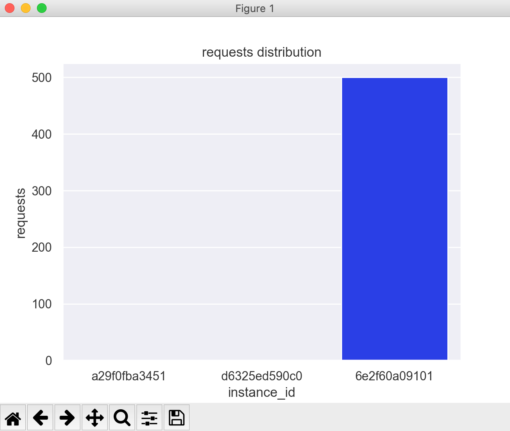

# envoy-lb-distribution-test
---
Distribution test examples for Envoy.

* docker dictionary contains `dockerfile` and `envoy.yaml` for different balancing cases 
* lb-tests contains `.py` scripts, which provide distribution result histograms
---
As an upstream it is suggested to use [echo-server](https://github.com/jmalloc/echo-server).
Current examples use 3 echo-server instances on 8081, 8082, 8083 ports.
It is recommended to use docker to launch them.
E.g.:
```
docker run --detach -p 8081:8080 -P jmalloc/echo-server
```

Build envoy image:
```
docker build -t envoy:test .
```
and launch:
```
docker run -p 8080:8080 -p 9901:9901 --rm envoy:test
```
Run python script to receive distribution histogram: 
```
python3 ring-hash.py
```

Histogram example:


